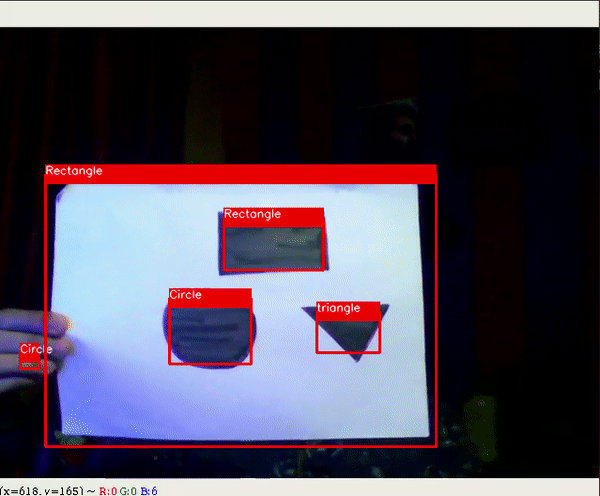
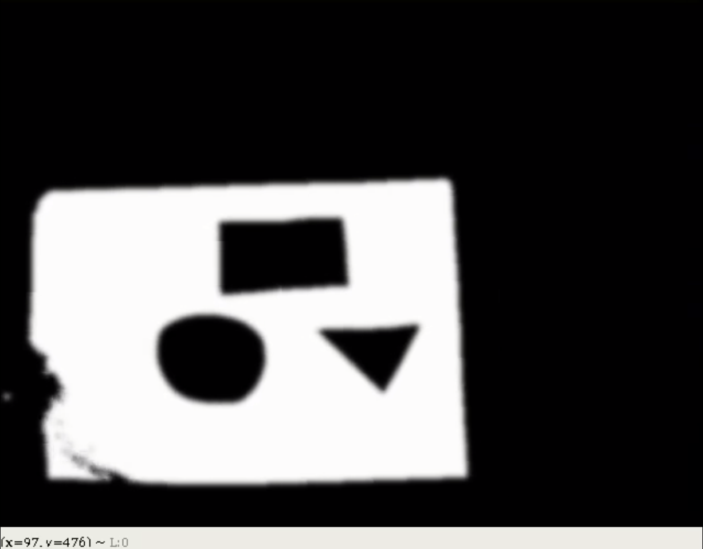

# Shape Detector using OpenCV

An application to detect hand drawn shapes using OpenCV 3.4.4

## Run

```bash
python capture.py --image assets/hand_shape.jpg  # for image
python capture.py -c  # use default webcam
```

## Limitations

 - Implemented only for:
   - triangle
   - rectangle
   - pentagon
   - circle
 
 - Images should be filled with dark colors
 
## Sample

Code in work



Backend


